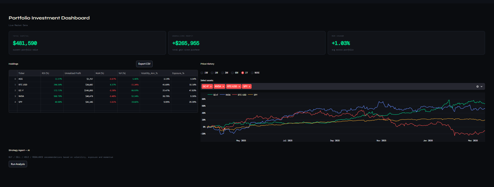
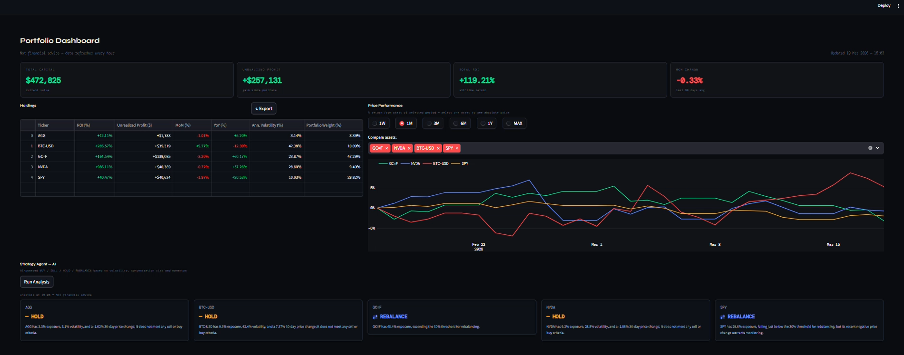

# Portfolio Investment Dashboard

## Table of Contents
- [Overview](#overview)
- [Tools](#tools)
- [Data Pipeline and Financial Metrics](#data-pipeline-and-financial-metrics)
- [AI Strategy Agent](#ai-strategy-agent)
- [Dashboard Structure](#dashboard-structure)
- [How to Run](#how-to-run)
- [Notes](#notes)


## Overview

This project is an interactive investment dashboard built with Python and Streamlit to monitor a multi-asset portfolio in real time. It pulls live market data from Yahoo Finance, computes financial metrics per asset, and integrates an AI strategy agent built with Google ADK and Gemini that returns BUY / SELL / HOLD / REBALANCE recommendations based on the last 30 days of portfolio data.

I started from a Google Colab notebook where I built and tested the full financial logic from scratch. I also did research on the financial side and on Kaggle for the AI agent implementation. The dashboard is the production result of that work.


*Figure 1: Main dashboard view showing metric cards, holdings table and price performance chart.*


*Figure 2: AI Strategy Agent output with per-asset recommendations.*


## Tools

- **Python** - pandas, numpy, yfinance, plotly
- **Streamlit** - dashboard framework
- **Google ADK + Gemini 2.5 Flash Lite** - AI strategy agent
- **Yahoo Finance API** - live and historical market data
- **python-dotenv** - environment variable management


## Data Pipeline and Financial Metrics

Market data is downloaded via `yfinance` for a 5-year period and cached for one hour. Portfolio holdings are read from a `financial_ledger.csv` file that stores each purchase transaction by ticker, date and quantity. I merged prices and ledger entries using `merge_asof` to match each purchase to its closest available market price.

For each asset I computed:

- **ROI (%)**: total return from purchase price to current price
- **Unrealized Profit ($)**: absolute gain or loss since purchase
- **DoD / MoM / YoY (%)**: price change over 1 day, 30 days and 365 days
- **Annualised Volatility (%)**: 30-day rolling standard deviation of daily returns, annualised by multiplying by 252
- **Portfolio Weight (%)**: each asset's share of total portfolio value

When multiple assets are selected in the chart, I normalised prices to percentage return from the start of the selected period so that assets with very different price scales can be compared directly. When a single asset is selected, the chart switches to absolute price.


## AI Strategy Agent

The agent receives a summary of the last 30 days per ticker: average portfolio exposure, annualised volatility, 30-day price change and total ROI. It applies decision rules in order and returns one line per asset in the format `TICKER | ACTION | explanation with actual numbers`. The output is rendered as individual cards in the dashboard.

Decision rules applied in order:

1. SELL if ROI > 500% and average exposure > 20%
2. REBALANCE if average exposure > 30%
3. SELL if volatility > 40% and 30-day price change < -5%
4. BUY if volatility < 15%, 30-day price change > 0% and exposure < 10%
5. HOLD otherwise

What I found most interesting was making the agent work with real portfolio numbers. Every recommendation references the actual data, not generic market commentary.

---

## Dashboard Structure

**Top row: Metric Cards**
Four KPI cards always visible: Total Capital, Unrealized Profit, Total ROI and MoM Change. An investor wants to know immediately how much the portfolio is worth today, how much has been gained and how the last month looks.

**Left column: Holdings Table**
Per-asset breakdown showing ROI, unrealized profit, MoM, YoY, annualised volatility and portfolio weight. Values are color-coded green and red. Includes a CSV export button.

**Right column: Price Performance Chart**
Interactive Plotly chart with period selectors (1W, 1M, 3M, 6M, 1Y, MAX) and asset multiselect.

**Bottom section: Strategy Agent**
One-click AI analysis. The agent processes real portfolio data and returns a structured recommendation for each asset with a plain-English motivation grounded in the actual numbers.


## How to Run

1. Clone the repository
```bash
git clone https://github.com/MariaVittoriaColtri/portfolio-tracker-streamlit.git
cd portfolio-tracker-streamlit
```

2. Install dependencies
```bash
pip install -r requirements.txt
```

3. Add your API key to a `.env` file
```
GOOGLE_API_KEY=your_key_here
```

4. Run the dashboard
```bash
streamlit run app.py
```

## Notes

- The `financial_ledger.csv` file contains simulated transaction data used for demonstration purposes.
- Data refreshes automatically every hour via Streamlit's `@st.cache_data(ttl=3600)`.
- The disclaimer *"Not financial advice"* is displayed throughout the interface intentionally.
